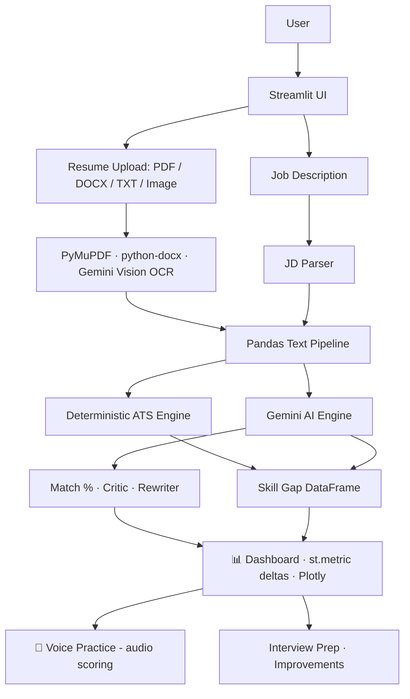

<div align="center">

```
╦═╗┌─┐┌─┐┌─┐┌─┐┬ ┬   ╦╗
╠╦╝│  │  ├─┤└─┐└┬┘───╠╩╗
╩╚═└─┘└─┘┴ ┴└─┘ ┴    ══╝
```

# 📄 ResumeIQ

### AI-Powered Resume Intelligence & Job Matching Platform

> *Know how well your resume fits the job — before the recruiter does.*


**🔗 Live Demo:** _Deploy with Streamlit Community Cloud using `app.py` as the entrypoint._

</div>

---

## ⚡ Quick Start

```bash
git clone https://github.com/<your-username>/resumeiq.git
cd resumeiq
python -m venv .venv
# Windows: .venv\Scripts\Activate.ps1
# macOS/Linux: source .venv/bin/activate
python -m pip install -r requirements.txt
copy .env.example .env        # Windows; use cp on macOS/Linux
streamlit run app.py
```

Deterministic parsing and scoring work without API keys. Add `GEMINI_API_KEY`
for semantic analysis, image OCR, and voice evaluation. Add `GROQ_API_KEY` to
enable the text-analysis fallback.

## 🧩 Problem → Solution

```text
PROBLEM                          SOLUTION
─────────────────────────────    ─────────────────────────────────────────
Candidates apply blind           Deterministic ATS score (0-100) in seconds
Missing skills discovered late   Skill gap: matched / partial / missing
Generic feedback is useless      Job-specific AI critic with rewrites
No interview prep pipeline       Tailored questions + voice answer scoring
Tech-only keyword matching       9-domain vocabulary: tech, marketing, sales,
                                 finance, healthcare, HR, design, education,
                                 operations — auto-detected from the JD
Scanned paper resumes ignored    Image upload → Gemini vision OCR
```

## ✨ Features

| # | Feature | Engine |
|---|---------|--------|
| 1 | Resume upload (PDF/DOCX/TXT/image) | PyMuPDF · python-docx · Gemini Vision |
| 2 | Job description analyzer | Section parser |
| 3 | Estimated ATS Compatibility Score | Deterministic weighted engine |
| 4 | **Multi-domain scoring** (auto-detect, profile override, or custom keywords) | `analysis/domains.py` profiles |
| 5 | Semantic job match % | Gemini structured JSON |
| 6 | Skill gap (matched/partial/missing) | Pandas DataFrame pipeline |
| 7 | Ruthless AI critic (weak→better bullets) | Gemini Prompt C |
| 8 | Resume rewriter (never invents facts) | Gemini Prompt D |
| 9 | Prioritized recommendations | Hybrid deterministic + AI |
| 10 | Interview questions (18, 4 categories) | Gemini |
| 11 | 🎙️ **Voice interview practice** — mic answer scored on radar chart | Gemini multimodal audio |
| 12 | Version comparison V1 vs V2 with delta | `st.metric` deltas |

## 🏗️ Architecture



## 🔄 Data Flow

```text
Upload/Camera Scan → File Validation → Text Extraction (PyMuPDF | Gemini Vision)
  → Cleaning → Section Detection → Structured Data
  → [Deterministic] keyword/tech/experience/project/education/structure scores
      → weighted ATS = kw·0.25 + tech·0.25 + exp·0.20 + proj·0.15 + edu·0.10 + struct·0.05
  → [Pandas] skill gap DataFrame → charts + editable table
  → [Gemini] semantic match %, critic, rewrites, interview Qs (JSON, validated in Python)
  → session_state cache → dashboard renders instantly on rerun
```

## 🔑 Gemini Integration Strategy

| Concern | Implementation |
|---|---|
| Centralized calls | `resumeiq/ai/gemini_client.py` only |
| Structured output | `response_mime_type="application/json"` + Python normalization |
| Dynamic context | f-strings inject resume + JD per request |
| Multimodal | Audio answers (`Part.from_bytes` WAV) · Image OCR (`image/jpeg`) |
| Resilience | Gemini → Groq free fallback → graceful degradation |
| Cost control | Calls only on form submit; results cached in `st.session_state` |

## 🎯 Prompt Engineering

Four specialized system prompts (`resumeiq/ai/prompts.py`):

- **A — Extraction:** "Do not invent information."
- **B — JD Analysis:** separate required vs preferred.
- **C — Critic:** every point = problem → why → fix.
- **D — Editor:** "Never invent employment/projects/metrics."

Plus runtime prompts for voice evaluation and vision OCR.

## 📊 Scoring Model

The **Estimated ATS Compatibility Score** is computed deterministically in Python — never invented by the AI:

```text
ATS = Keyword×0.25 + Skill Relevance×0.25 + Experience×0.20
    + Projects×0.15 + Education×0.10 + Structure×0.05
```

## 📁 Project Structure

```text
├── app.py                     # Streamlit entrypoint + router
├── resumeiq/
│   ├── ai/                    # gemini_client · prompts · analyzer
│   ├── parser/                # resume_parser · jd_parser · section_extractor
│   ├── analysis/              # ats_scorer · skill_matcher (+df) · experience_analyzer · scoring
│   ├── ui/                    # 9 pages incl. voice_interview.py
│   └── utils/                 # text_cleaner · validators
├── docs/TECHNICAL_DESIGN.md   # design document
├── tests/                     # 73 unit tests
├── sample_data/               # sample_resume.pdf · sample_job.txt
├── assets/architecture.png
├── scripts/generate_assets.py
└── requirements.txt
```

## 🧪 Testing

```bash
python -m unittest discover -s tests -v     # 73/73 passing
python -m compileall -q app.py resumeiq
```

## 🚀 Deployment (Streamlit Community Cloud)

1. Push this repository to GitHub. Do not commit `.env` or API keys.
2. Open [Streamlit Community Cloud](https://share.streamlit.io) and create an app.
3. Select the branch and `app.py` as the main file.
4. Add API keys under App Settings → Secrets:

```toml
GEMINI_API_KEY = "your-key"
GROQ_API_KEY = "your-key"
```

5. Deploy and verify uploads, deterministic scoring, and AI fallback behavior.

The checked-in `.streamlit/config.toml` provides the theme, 10 MB upload limit,
headless server mode, and disabled usage statistics. Secrets remain local or are
provided by the hosting platform.

## 🔒 Privacy and Limitations

- Score is an estimate, not an employer's actual ATS verdict.
- Resume and job-description text stays in Streamlit session state and is sent
    to configured AI providers only when an AI feature is requested.
- Image-only PDFs need the image/vision path (no local OCR dependency).
- Provider quotas and model availability can affect AI features; deterministic
    scoring remains available without AI.
- Streamlit session state is not permanent storage; refreshes can clear results.

## 🔮 Future Improvements

- Multi-JD comparison mode · improved-resume PDF export · embedding-based matching

## 👤 Author

Built with Python · Streamlit · Gemini · Groq — MIT Licensed.
